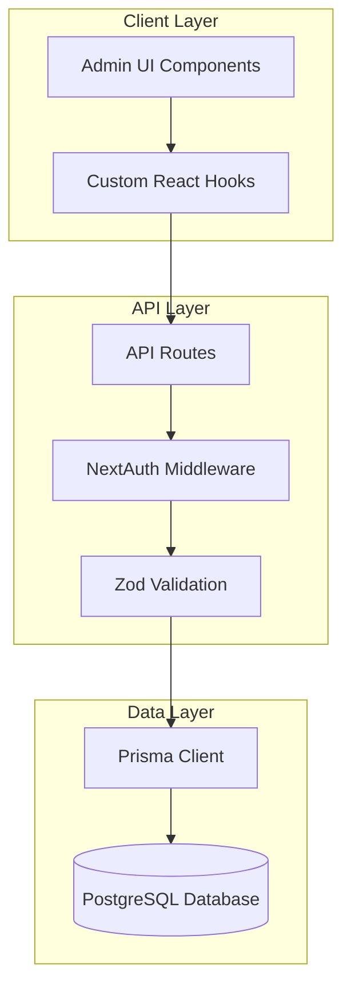

# Design Document: Admin Panel Full Integration

## Overview

This design document outlines the architecture and implementation strategy for a comprehensive admin panel that enables complete management of the NepX Creation website content through a database-backed interface. The system leverages Next.js 14 App Router, Prisma ORM with PostgreSQL, NextAuth.js for authentication, and React with TypeScript for the frontend.

The admin panel provides CRUD operations for all content types (services, projects, testimonials, technologies, site content, settings, users, and contact submissions) with real-time updates to the public website. The architecture follows a layered approach with clear separation between API routes, business logic, data access, and UI components.

## Architecture

### High-Level Architecture



### Technology Stack

- **Frontend**: React 18, TypeScript, Tailwind CSS, Framer Motion
- **Backend**: Next.js 14 App Router, API Routes
- **Database**: PostgreSQL with Prisma ORM
- **Authentication**: NextAuth.js with JWT strategy
- **Validation**: Zod schema validation
- **UI Feedback**: React Hot Toast
- **State Management**: React hooks with local state

### Authentication Flow

1. User submits credentials via login form
2. NextAuth CredentialsProvider validates against database
3. Password verified using bcrypt comparison
4. JWT token generated with user ID and role
5. Middleware protects all `/admin/*` routes except `/admin/login`
6. Session persists for 30 days with automatic refresh

## Components and Interfaces

### API Route Structure

All admin API routes follow a consistent pattern:

**Base Routes** (`/api/admin/[resource]/route.ts`):
- `GET`: Fetch all resources with ordering
- `POST`: Create new resource with validation

**Individual Resource Routes** (`/api/admin/[resource]/[id]/route.ts`):
- `GET`: Fetch single resource by ID
- `PUT`: Update resource with partial data
- `DELETE`: Remove resource from database

### Custom Hooks Pattern

Each resource has a corresponding custom hook that encapsulates:
- State management (data, loading, error)
- CRUD operations (create, update, delete)
- Automatic data fetching on mount
- Optimistic UI updates
- Toast notifications for user feedback
- Error handling

**Hook Interface Example**:
```typescript
interface UseResourceHook<T> {
  data: T[];
  loading: boolean;
  error: string | null;
  create: (input: CreateInput) => Promise<T>;
  update: (id: string, input: UpdateInput) => Promise<T>;
  delete: (id: string) => Promise<void>;
  refetch: () => Promise<void>;
}
```

### Admin UI Components

**Layout Components**:
- `AdminSidebar`: Navigation with active route highlighting
- `AdminHeader`: User info, logout, breadcrumbs
- `AdminLayout`: Wrapper providing consistent structure

**Page Components**:
- Resource management pages (Services, Projects, etc.)
- Dashboard with statistics
- Settings management
- User management

**Shared UI Components**:
- `GlassCard`: Glassmorphism card container
- `Button`: Consistent button styling with variants
- `Input/Textarea`: Form inputs with labels
- Modal dialogs for create/edit operations

## Data Models

### Core Models

**User**:
- Authentication and authorization
- Role-based access (ADMIN, EDITOR)
- Secure password storage with bcrypt

**Service**:
- Title, description, icon, gradient
- Features array (JSON)
- Order and active status for display control

**Project**:
- Portfolio items with images
- Category and technology tags (JSON)
- Featured flag for prominence
- External links (live site, GitHub)

**Testimonial**:
- Client feedback with ratings
- Optional profile image
- Order and active status

**Technology**:
- Tech stack display
- Category grouping
- Color customization

**SiteContent**:
- Dynamic content sections (Hero, About, Contact)
- JSON storage for flexible structure
- Section-based retrieval

**SiteSettings**:
- Key-value configuration store
- Theme colors, fonts, SEO metadata
- Social media links

**ContactSubmission**:
- Form submissions from public site
- Read/unread tracking
- No update capability (immutable)

### Database Schema Considerations

- All models use `cuid()` for IDs (collision-resistant)
- Timestamps (`createdAt`, `updatedAt`) for audit trail
- JSON fields for flexible nested data
- Unique constraints on critical fields (email, section keys)
- Default values for boolean and numeric fields
- Text fields for long content (descriptions, messages)


## Correctness Properties

*A property is a characteristic or behavior that should hold true across all valid executions of a system—essentially, a formal statement about what the system should do. Properties serve as the bridge between human-readable specifications and machine-verifiable correctness guarantees.*

### Resource Management Properties

**Property 1: Resource creation persistence**
*For any* valid resource (Service, Project, Testimonial, Technology) with valid input data, creating it via the admin API should result in the resource being stored in the database and returned by subsequent GET requests with all fields intact.
**Validates: Requirements 1.1, 2.1, 3.1, 4.1**

**Property 2: Resource update persistence**
*For any* existing resource and any valid partial update data, updating the resource via the admin API should result in the specified fields being modified in the database while preserving unchanged fields, and the updated data should be immediately retrievable.
**Validates: Requirements 1.2, 2.3, 3.3, 4.3, 8.3, 10.1**

**Property 3: Resource deletion completeness**
*For any* existing resource, deleting it via the admin API should result in the resource no longer being returned by any GET requests (admin or public) and should return a 404 error if accessed by ID.
**Validates: Requirements 1.3, 4.4, 7.4, 8.4**

**Property 4: Active status visibility control**
*For any* resource with an active status field, when active is set to false, the resource should not be returned by public API endpoints, but should still be accessible via admin API endpoints.
**Validates: Requirements 1.5, 3.4, 10.3**

**Property 5: Resource ordering consistency**
*For any* collection of resources with order fields, the resources should always be returned sorted by the order field in ascending order, and updating order values should immediately affect the sort order in subsequent requests.
**Validates: Requirements 1.4, 3.5, 10.4**

### Content and Settings Properties

**Property 6: Content section update persistence**
*For any* content section (Hero, About, Contact) and any valid JSON content update, updating the section via the admin API should persist the changes and make them immediately available via the public content API for that section.
**Validates: Requirements 5.1, 5.2, 5.3, 5.4**

**Property 7: Content validation enforcement**
*For any* content section update with missing required fields, the API should reject the request with a 400 status code and appropriate validation error messages, and the database should remain unchanged.
**Validates: Requirements 5.5**

**Property 8: Settings update persistence**
*For any* settings key-value pair, updating the setting via the admin API should persist the change and make it immediately retrievable via the settings API.
**Validates: Requirements 6.1, 6.2, 6.3, 6.4, 6.5**

### Authentication and Authorization Properties

**Property 9: Password hashing security**
*For any* user creation or password reset operation, the password stored in the database should never match the plaintext password provided, indicating proper hashing has occurred.
**Validates: Requirements 8.1, 8.5**

**Property 10: Authentication requirement enforcement**
*For any* admin API endpoint (except login), requests without a valid authentication token should receive a 401 Unauthorized response and should not modify any data.
**Validates: Requirements 8.2**

**Property 11: Role-based access control**
*For any* user with a specific role, attempting to access resources or perform actions outside their role permissions should result in a 403 Forbidden response.
**Validates: Requirements 8.2**

### Contact Form and Messaging Properties

**Property 12: Contact submission persistence**
*For any* valid contact form submission from the public API, the message should be stored in the database with read status set to false and should be retrievable via the admin messages API.
**Validates: Requirements 7.1**

**Property 13: Message status update**
*For any* existing message, updating its read status via the admin API should persist the change and subsequent GET requests should return the updated status.
**Validates: Requirements 7.3**

**Property 14: Message filtering by status**
*For any* collection of messages with different read statuses, filtering by read/unread should return only messages matching the specified status.
**Validates: Requirements 7.2**

### Dashboard and Statistics Properties

**Property 15: Dashboard statistics accuracy**
*For any* state of the database, the dashboard statistics API should return counts that exactly match the actual number of records in each table (projects, services, testimonials, technologies, messages).
**Validates: Requirements 9.1**

**Property 16: Unread message count accuracy**
*For any* collection of messages, the unread count returned by the dashboard API should exactly match the number of messages where read is false.
**Validates: Requirements 9.2**

**Property 17: Recent activity ordering**
*For any* collection of resources, the recent activity list should return items sorted by updatedAt timestamp in descending order (most recent first).
**Validates: Requirements 9.3**

### Data Integrity and Error Handling Properties

**Property 18: Public API immediate consistency**
*For any* resource modification (create, update, delete, status change) via the admin API, the public API should immediately reflect the change in the next request without caching delays.
**Validates: Requirements 10.1, 10.2**

**Property 19: Category filtering correctness**
*For any* resource type with category fields (Projects, Technologies), filtering by a specific category should return only resources where the category field exactly matches the filter value.
**Validates: Requirements 2.5, 4.2**

**Property 20: Featured flag behavior**
*For any* project, setting the featured flag to true should result in the project being marked as featured in the database and returned with featured=true by all API endpoints.
**Validates: Requirements 2.4**

**Property 21: Image URL persistence**
*For any* resource with image fields (Project, Testimonial), providing an image URL during creation or update should result in that exact URL being stored and returned in subsequent requests.
**Validates: Requirements 2.2**

**Property 22: Rating value constraints**
*For any* testimonial, the rating value should be stored as provided (within valid range 1-5) and returned exactly as stored.
**Validates: Requirements 3.2**

**Property 23: Technology color persistence**
*For any* technology, the color value provided should be stored exactly as given and returned in all subsequent requests.
**Validates: Requirements 4.5**

**Property 24: Error response consistency**
*For any* API request that encounters a database error or validation failure, the response should include a success: false field, an appropriate HTTP status code (400, 401, 403, 404, 500), and a descriptive error message.
**Validates: Requirements 10.5**

## Error Handling

### Validation Errors (400 Bad Request)

- Missing required fields
- Invalid data types
- Out-of-range values (e.g., rating not between 1-5)
- Malformed JSON in request body
- Zod schema validation failures

**Response Format**:
```json
{
  "success": false,
  "error": "Validation error",
  "details": [
    {
      "field": "title",
      "message": "Title is required"
    }
  ]
}
```

### Authentication Errors (401 Unauthorized)

- Missing authentication token
- Expired JWT token
- Invalid credentials during login
- Token signature verification failure

**Response Format**:
```json
{
  "success": false,
  "error": "Unauthorized"
}
```

### Authorization Errors (403 Forbidden)

- Insufficient role permissions
- Attempting to access resources outside role scope

**Response Format**:
```json
{
  "success": false,
  "error": "Forbidden: Insufficient permissions"
}
```

### Not Found Errors (404 Not Found)

- Resource ID does not exist
- Attempting to update/delete non-existent resource

**Response Format**:
```json
{
  "success": false,
  "error": "Resource not found"
}
```

### Server Errors (500 Internal Server Error)

- Database connection failures
- Unexpected exceptions
- Prisma query errors

**Response Format**:
```json
{
  "success": false,
  "error": "Internal server error"
}
```

### Error Handling Strategy

1. **Validation Layer**: Zod schemas validate input before database operations
2. **Try-Catch Blocks**: All API routes wrapped in try-catch for exception handling
3. **Prisma Error Handling**: Specific handling for unique constraint violations, foreign key errors
4. **Logging**: Console errors in development, structured logging in production
5. **User Feedback**: Toast notifications in UI for all error conditions
6. **Graceful Degradation**: UI shows loading states and error messages without crashing

## Testing Strategy

### Unit Testing

Unit tests will verify specific examples and edge cases for:

- **Validation Logic**: Test Zod schemas with valid and invalid inputs
- **Authentication**: Test credential validation, token generation, password hashing
- **API Route Handlers**: Test individual endpoints with mock Prisma client
- **Custom Hooks**: Test state management and API call logic with mock fetch
- **Utility Functions**: Test helper functions for data transformation

**Example Unit Tests**:
- Empty string validation rejection
- Password hashing produces different output than input
- Invalid email format rejection
- Duplicate email handling
- Order field auto-increment on creation
- Partial update preserves unchanged fields

### Property-Based Testing

Property-based tests will verify universal properties across all inputs using **fast-check** (JavaScript/TypeScript property-based testing library).

**Configuration**:
- Minimum 100 iterations per property test
- Custom generators for domain-specific data (Services, Projects, etc.)
- Shrinking enabled to find minimal failing cases

**Property Test Requirements**:
- Each property test MUST be tagged with a comment: `// Feature: admin-panel-full-integration, Property X: [property description]`
- Each correctness property MUST be implemented by a SINGLE property-based test
- Tests should use real database operations (integration-style) or mock Prisma with consistent behavior

**Example Property Tests**:
- Property 1: Generate random service data, create via API, verify persistence
- Property 4: Generate resources with random active status, verify public API filtering
- Property 9: Generate random passwords, create users, verify hashing
- Property 15: Generate random database state, verify dashboard counts match actual counts

### Integration Testing

Integration tests will verify end-to-end workflows:

- Complete CRUD cycles for each resource type
- Authentication flow from login to protected route access
- Public API reflecting admin changes immediately
- Dashboard statistics updating after content changes
- Contact form submission to admin message retrieval

### Test Organization

```
tests/
├── unit/
│   ├── validation/
│   ├── auth/
│   └── utils/
├── property/
│   ├── resources.test.ts
│   ├── auth.test.ts
│   ├── content.test.ts
│   └── dashboard.test.ts
└── integration/
    ├── services.test.ts
    ├── projects.test.ts
    └── auth-flow.test.ts
```

### Testing Tools

- **Test Runner**: Jest or Vitest
- **Property Testing**: fast-check
- **API Testing**: Supertest or native fetch with test database
- **Database**: Separate test database or in-memory SQLite for speed
- **Mocking**: Mock Service Worker (MSW) for frontend tests
- **Coverage**: Aim for >80% code coverage on critical paths

## Implementation Considerations

### Performance Optimization

- **Database Indexing**: Index frequently queried fields (email, section, category, order)
- **Query Optimization**: Use Prisma's select to fetch only needed fields
- **Pagination**: Implement cursor-based pagination for large datasets
- **Caching Strategy**: Consider Redis for frequently accessed settings and content

### Security Measures

- **Input Sanitization**: Zod validation prevents injection attacks
- **Password Security**: bcrypt with appropriate salt rounds (10+)
- **JWT Security**: Secure secret, appropriate expiration, HTTP-only cookies in production
- **CORS Configuration**: Restrict origins in production
- **Rate Limiting**: Implement rate limiting on API routes to prevent abuse
- **SQL Injection Prevention**: Prisma's parameterized queries provide protection

### Scalability Considerations

- **Database Connection Pooling**: Prisma handles connection pooling automatically
- **Stateless API**: JWT-based auth enables horizontal scaling
- **CDN for Assets**: Serve images and static assets via CDN
- **Database Replication**: Read replicas for public API queries
- **Monitoring**: Implement logging and monitoring for performance tracking

### Deployment Strategy

- **Environment Variables**: Secure storage of DATABASE_URL, NEXTAUTH_SECRET
- **Database Migrations**: Prisma migrate for schema changes
- **Zero-Downtime Deploys**: Blue-green deployment or rolling updates
- **Health Checks**: Endpoint for monitoring service availability
- **Backup Strategy**: Automated database backups with point-in-time recovery

### Future Enhancements

- **Image Upload**: Direct file upload instead of URL-only
- **Rich Text Editor**: WYSIWYG editor for content sections
- **Audit Logging**: Track all admin actions with timestamps and user info
- **Bulk Operations**: Bulk update, delete, reorder operations
- **Search Functionality**: Full-text search across resources
- **Export/Import**: CSV/JSON export for backup and migration
- **Email Notifications**: Automated emails for contact form submissions
- **Multi-language Support**: i18n for admin panel and content
