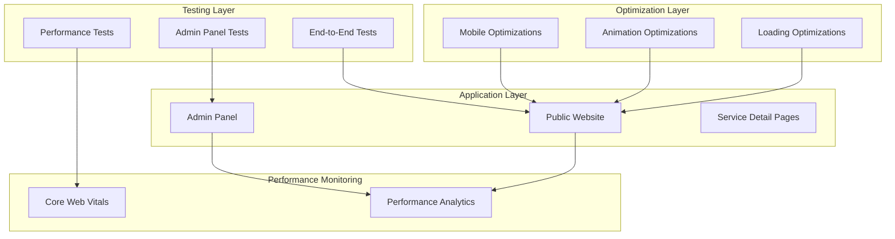

# Design Document: Website Optimization and Testing

## Overview

This design document outlines the comprehensive strategy for testing all admin panel functionality, fixing mobile scrolling issues, optimizing website performance for slow internet connections, ensuring service detail pages work correctly, and making the Spline 3D design responsive across all devices.

The solution leverages Next.js 14 performance features, CSS optimizations, responsive design patterns, and comprehensive testing strategies to deliver a fast, reliable, and user-friendly experience across all devices and network conditions.

## Architecture

### High-Level Architecture



### Technology Stack

- **Frontend**: React 18, TypeScript, Tailwind CSS, Framer Motion
- **Backend**: Next.js 14 App Router with API Routes
- **Database**: PostgreSQL with Prisma ORM
- **Testing**: Playwright for E2E, Jest for unit tests
- **Performance**: Next.js Image Optimization, CSS GPU acceleration
- **Monitoring**: Web Vitals API, Lighthouse CI

## Components and Interfaces

### Admin Panel Testing Strategy

**Test Coverage Areas**:
1. **Services Management**: Create, read, update, delete, reorder
2. **Projects Management**: CRUD operations, image handling, featured flag
3. **Testimonials Management**: CRUD operations, rating system, ordering
4. **Technologies Management**: CRUD operations, category grouping, color customization
5. **Content Sections**: Hero, About, Contact section editing
6. **Courses Management**: CRUD operations, course details
7. **Settings Management**: Theme colors, SEO, social links
8. **User Management**: User CRUD, role assignment, password management
9. **Messages Management**: View, mark as read, delete operations
10. **Dashboard Statistics**: Real-time counts and recent activity

**Testing Interface Pattern**:
```typescript
interface AdminTestSuite {
  testCreate: (data: CreateInput) => Promise<TestResult>;
  testRead: (id: string) => Promise<TestResult>;
  testUpdate: (id: string, data: UpdateInput) => Promise<TestResult>;
  testDelete: (id: string) => Promise<TestResult>;
  testValidation: (invalidData: any) => Promise<TestResult>;
  testPublicReflection: () => Promise<TestResult>;
}

interface TestResult {
  passed: boolean;
  message: string;
  duration: number;
  errors?: string[];
}
```

### Mobile Scrolling Optimization

**CSS Optimizations**:
```css
/* Enable hardware-accelerated smooth scrolling */
html {
  scroll-behavior: smooth;
  -webkit-overflow-scrolling: touch;
  overscroll-behavior: none;
}

body {
  overscroll-behavior-y: none;
  touch-action: pan-y;
}

/* Optimize scroll performance */
* {
  -webkit-transform: translateZ(0);
  transform: translateZ(0);
}
```

**JavaScript Scroll Handler**:
```typescript
// Passive event listeners for better performance
window.addEventListener('scroll', handleScroll, { passive: true });
window.addEventListener('touchstart', handleTouch, { passive: true });
```

### Performance Optimization Strategy

**1. Animation Optimization**:
- Reduce Framer Motion animation durations from 0.6s to 0.3s
- Limit particle count on mobile devices (max 40 particles)
- Use CSS transforms and opacity only (GPU-accelerated)
- Implement `will-change` property strategically
- Remove `will-change` after animations complete

**2. Loading Optimization**:
- Implement progressive image loading
- Lazy load Spline 3D design
- Code splitting for admin panel
- Defer non-critical JavaScript
- Preload critical resources

**3. Resource Optimization**:
- Compress images to WebP/AVIF formats
- Minify CSS and JavaScript
- Enable Gzip/Brotli compression
- Implement service worker caching
- Use CDN for static assets

### Service Detail Page Implementation

**Route Structure**:
```
/services/[id]/page.tsx
```

**Data Fetching Strategy**:
```typescript
// Server-side data fetching for SEO
async function getServiceData(id: string) {
  const service = await prisma.service.findUnique({
    where: { id },
    include: { subServices: true }
  });
  return service;
}
```

**Navigation Pattern**:
- Previous/Next service navigation
- Back to services link
- Breadcrumb navigation
- Mobile-optimized touch targets

### Spline Responsive Design

**Responsive Sizing Strategy**:
```typescript
const splineSizes = {
  mobile: { width: '100%', height: '280px' },      // < 640px
  mobileLarge: { width: '100%', height: '320px' }, // 640px - 767px
  tablet: { width: '100%', height: '450px' },      // 768px - 1023px
  desktop: { width: '100%', height: '600px' },     // >= 1024px
};
```

**CSS Implementation**:
```css
.spline-responsive {
  width: 100%;
  height: 280px;
}

@media (min-width: 640px) {
  .spline-responsive { height: 380px; }
}

@media (min-width: 768px) {
  .spline-responsive { height: 450px; }
}

@media (min-width: 1024px) {
  .spline-responsive { height: 600px; }
}
```

## Data Models

### Test Result Model

```typescript
interface TestResult {
  id: string;
  testName: string;
  category: 'admin' | 'mobile' | 'performance' | 'service';
  passed: boolean;
  duration: number;
  timestamp: Date;
  errors: string[];
  metadata: Record<string, any>;
}
```

### Performance Metrics Model

```typescript
interface PerformanceMetrics {
  lcp: number;  // Largest Contentful Paint
  fid: number;  // First Input Delay
  cls: number;  // Cumulative Layout Shift
  tti: number;  // Time to Interactive
  tbt: number;  // Total Blocking Time
  si: number;   // Speed Index
  device: 'mobile' | 'tablet' | 'desktop';
  connection: '3g' | '4g' | 'wifi';
}
```


## Correctness Properties

*A property is a characteristic or behavior that should hold true across all valid executions of a system—essentially, a formal statement about what the system should do. Properties serve as the bridge between human-readable specifications and machine-verifiable correctness guarantees.*

### Admin Panel Testing Properties

**Property 1: Admin edits persist to public site**
*For any* content type (service, project, testimonial, technology, content section, course, setting, user), when an administrator edits it via the admin API, the updated data should be immediately retrievable via the public API
**Validates: Requirements 1.1, 1.2, 1.3, 1.4, 1.5, 1.6, 1.7, 1.8**

**Property 2: Admin operations provide feedback**
*For any* admin operation (create, update, delete), the system should display either a success toast notification or an error message with actionable information
**Validates: Requirements 1.10, 8.1, 8.2**

**Property 3: Form validation rejects invalid inputs**
*For any* admin form with validation rules, submitting invalid data should result in rejection with specific error messages highlighting problematic fields
**Validates: Requirements 7.2, 8.5**

**Property 4: Data persistence is complete**
*For any* admin edit operation, all modified fields should be saved to the database and retrievable in subsequent requests
**Validates: Requirements 7.3**

**Property 5: Error handling is graceful**
*For any* admin operation that fails, the system should handle the error gracefully, display an appropriate message, and provide retry options without losing user input
**Validates: Requirements 7.5, 8.8**

**Property 6: Loading states are visible**
*For any* async admin operation, the system should display loading indicators and disable submit buttons during the operation
**Validates: Requirements 8.3, 8.4, 8.6**

**Property 7: Optimistic UI updates occur**
*For any* admin save operation, the UI should update immediately before the server response to provide instant feedback
**Validates: Requirements 8.7**

### Performance Optimization Properties

**Property 8: Animations use GPU acceleration**
*For any* animation in the application, it should only use CSS transform and opacity properties to ensure GPU acceleration
**Validates: Requirements 3.2, 3.8, 6.1**

**Property 9: Particle count adapts to device**
*For any* device viewport width, the particle background should use a particle count appropriate for that device size (fewer particles on mobile)
**Validates: Requirements 6.4**

**Property 10: Will-change is removed after animations**
*For any* element with animations, the will-change CSS property should be removed after the animation completes to free GPU resources
**Validates: Requirements 6.7**

**Property 11: Animations are staggered**
*For any* group of simultaneous animations, they should be staggered with delays to prevent frame drops
**Validates: Requirements 6.2**

### Service Detail Page Properties

**Property 12: Service detail page displays all data**
*For any* valid service, the detail page should display all service fields including title, description, features, sub-services, and benefits
**Validates: Requirements 4.2, 4.3**

**Property 13: Touch targets meet minimum size**
*For any* interactive element on mobile devices, it should have a minimum touch target size of 44x44 pixels
**Validates: Requirements 4.7, 9.2**

### Spline Responsiveness Properties

**Property 14: Spline scales to viewport**
*For any* viewport width, the Spline container should scale appropriately without causing horizontal overflow
**Validates: Requirements 5.1**

**Property 15: Spline maintains aspect ratio**
*For any* device category (mobile, tablet, desktop), the Spline container should use appropriate aspect ratios and heights
**Validates: Requirements 5.7**

### Touch Interaction Properties

**Property 16: Interactive elements provide feedback**
*For any* tappable element, it should provide immediate visual feedback through active states or touch ripples
**Validates: Requirements 9.1, 9.6**

**Property 17: Form inputs use correct types**
*For any* form input field, it should use the appropriate input type (email, tel, number) to trigger correct mobile keyboards
**Validates: Requirements 9.5**


## Error Handling

### Mobile Scrolling Errors

**Scroll Jank (Performance Issue)**:
- **Cause**: Heavy JavaScript execution during scroll
- **Solution**: Use passive event listeners, debounce scroll handlers
- **Prevention**: Implement `will-change` strategically, use CSS transforms

**Rubber-band Effect**:
- **Cause**: Default browser overscroll behavior
- **Solution**: Set `overscroll-behavior: none` on body
- **CSS**: `body { overscroll-behavior-y: none; }`

**Fixed Element Jitter**:
- **Cause**: Lack of GPU acceleration on fixed elements
- **Solution**: Add `transform: translateZ(0)` to fixed elements
- **CSS**: `.fixed { transform: translateZ(0); }`

### Performance Errors

**Slow Initial Load**:
- **Cause**: Large JavaScript bundles, unoptimized images
- **Solution**: Code splitting, image optimization, lazy loading
- **Monitoring**: Track LCP, FCP metrics

**Animation Frame Drops**:
- **Cause**: Too many concurrent animations, CPU-intensive properties
- **Solution**: Limit animations, use GPU-accelerated properties only
- **Detection**: Monitor FPS with Performance API

**Layout Shifts**:
- **Cause**: Images without dimensions, dynamic content injection
- **Solution**: Set explicit dimensions, use skeleton loaders
- **Monitoring**: Track CLS metric

### Service Detail Page Errors

**404 Not Found**:
- **Cause**: Invalid service ID in URL
- **Solution**: Display user-friendly error page with back link
- **Response**: Show "Service Not Found" message

**Data Loading Failure**:
- **Cause**: Database connection error, network timeout
- **Solution**: Display error message with retry button
- **Fallback**: Show cached data if available

### Spline Loading Errors

**Spline Fails to Load**:
- **Cause**: Network error, CDN unavailable
- **Solution**: Show fallback static image or gradient
- **Timeout**: 10 seconds before showing fallback

**Performance Degradation**:
- **Cause**: Low-end device, slow GPU
- **Solution**: Reduce Spline quality or show static alternative
- **Detection**: Monitor frame rate, switch if < 30fps

## Testing Strategy

### Unit Testing

Unit tests will verify specific functionality and edge cases:

**Admin Panel Tests**:
- Test form validation with invalid inputs
- Test API error handling with mock failures
- Test toast notification display
- Test loading state management
- Test optimistic UI updates

**Performance Tests**:
- Test animation property usage (transform/opacity only)
- Test particle count calculation for different screen sizes
- Test will-change property removal
- Test animation staggering logic

**Responsive Tests**:
- Test Spline container dimensions at different breakpoints
- Test touch target size calculations
- Test viewport overflow detection

**Example Unit Tests**:
```typescript
describe('Admin Service Edit', () => {
  it('should show error toast on invalid data', async () => {
    const result = await updateService('id', { title: '' });
    expect(result.error).toBeDefined();
    expect(toast.error).toHaveBeenCalled();
  });

  it('should disable button during submission', async () => {
    const button = screen.getByRole('button');
    fireEvent.click(button);
    expect(button).toBeDisabled();
  });
});
```

### Property-Based Testing

Property-based tests will verify universal properties using **fast-check** library.

**Configuration**:
- Minimum 100 iterations per property test
- Custom generators for admin data types
- Shrinking enabled for minimal failing cases

**Property Test Examples**:

```typescript
// Feature: website-optimization-testing, Property 1: Admin edits persist to public site
test('admin edits persist to public site', async () => {
  await fc.assert(
    fc.asyncProperty(
      fc.record({
        title: fc.string({ minLength: 1, maxLength: 100 }),
        description: fc.string({ minLength: 1, maxLength: 500 }),
        active: fc.boolean(),
      }),
      async (serviceData) => {
        // Create service via admin API
        const created = await adminAPI.createService(serviceData);
        
        // Verify it appears on public API
        const publicData = await publicAPI.getService(created.id);
        
        expect(publicData.title).toBe(serviceData.title);
        expect(publicData.description).toBe(serviceData.description);
        
        // Update via admin API
        const updated = await adminAPI.updateService(created.id, {
          title: 'Updated Title'
        });
        
        // Verify update appears on public API immediately
        const publicUpdated = await publicAPI.getService(created.id);
        expect(publicUpdated.title).toBe('Updated Title');
      }
    ),
    { numRuns: 100 }
  );
});

// Feature: website-optimization-testing, Property 8: Animations use GPU acceleration
test('animations only use GPU-accelerated properties', async () => {
  await fc.assert(
    fc.asyncProperty(
      fc.constantFrom('FadeIn', 'SlideUp', 'ScaleIn'),
      async (animationComponent) => {
        const element = render(animationComponent);
        const computedStyle = window.getComputedStyle(element);
        const transition = computedStyle.transition;
        
        // Verify only transform and opacity are animated
        expect(transition).toMatch(/transform|opacity/);
        expect(transition).not.toMatch(/width|height|top|left|margin|padding/);
      }
    ),
    { numRuns: 100 }
  );
});

// Feature: website-optimization-testing, Property 9: Particle count adapts to device
test('particle count adapts to viewport size', async () => {
  await fc.assert(
    fc.asyncProperty(
      fc.integer({ min: 320, max: 3840 }),
      async (viewportWidth) => {
        // Set viewport width
        window.innerWidth = viewportWidth;
        
        // Render particle background
        const particles = getParticleCount();
        
        // Verify particle count is appropriate for device
        if (viewportWidth < 768) {
          expect(particles).toBeLessThanOrEqual(40);
        } else if (viewportWidth < 1024) {
          expect(particles).toBeLessThanOrEqual(60);
        } else {
          expect(particles).toBeLessThanOrEqual(80);
        }
      }
    ),
    { numRuns: 100 }
  );
});
```

### Integration Testing

Integration tests will verify end-to-end workflows using **Playwright**:

**Admin Panel E2E Tests**:
1. Login to admin panel
2. Navigate to services page
3. Create new service
4. Verify service appears in list
5. Edit service details
6. Navigate to public site
7. Verify updated service is visible
8. Return to admin
9. Delete service
10. Verify service is removed from public site

**Mobile Scrolling Tests**:
1. Open site on mobile viewport
2. Perform scroll gestures
3. Verify smooth scrolling (no jank)
4. Test fixed header stability
5. Verify no horizontal overflow

**Performance Tests**:
1. Run Lighthouse audit
2. Verify LCP < 2.5s
3. Verify FID < 100ms
4. Verify CLS < 0.1
5. Test on throttled 3G connection
6. Verify page remains usable

**Service Detail Tests**:
1. Click on service card
2. Verify navigation to detail page
3. Verify all service data is displayed
4. Test prev/next navigation
5. Test back to services link
6. Test with invalid service ID
7. Verify error handling

### Performance Monitoring

**Core Web Vitals Tracking**:
```typescript
// Track LCP
new PerformanceObserver((list) => {
  const entries = list.getEntries();
  const lastEntry = entries[entries.length - 1];
  console.log('LCP:', lastEntry.renderTime || lastEntry.loadTime);
}).observe({ entryTypes: ['largest-contentful-paint'] });

// Track FID
new PerformanceObserver((list) => {
  list.getEntries().forEach((entry) => {
    console.log('FID:', entry.processingStart - entry.startTime);
  });
}).observe({ entryTypes: ['first-input'] });

// Track CLS
let clsScore = 0;
new PerformanceObserver((list) => {
  list.getEntries().forEach((entry) => {
    if (!entry.hadRecentInput) {
      clsScore += entry.value;
    }
  });
  console.log('CLS:', clsScore);
}).observe({ entryTypes: ['layout-shift'] });
```

### Test Organization

```
tests/
├── unit/
│   ├── admin/
│   │   ├── services.test.ts
│   │   ├── projects.test.ts
│   │   └── validation.test.ts
│   ├── performance/
│   │   ├── animations.test.ts
│   │   └── particles.test.ts
│   └── responsive/
│       ├── spline.test.ts
│       └── touch-targets.test.ts
├── property/
│   ├── admin-persistence.test.ts
│   ├── animation-performance.test.ts
│   ├── responsive-design.test.ts
│   └── touch-interaction.test.ts
├── integration/
│   ├── admin-workflow.spec.ts
│   ├── mobile-scrolling.spec.ts
│   ├── service-details.spec.ts
│   └── performance.spec.ts
└── fixtures/
    ├── services.ts
    ├── projects.ts
    └── users.ts
```

### Testing Tools

- **Test Runner**: Vitest for unit and property tests
- **Property Testing**: fast-check for property-based tests
- **E2E Testing**: Playwright for integration tests
- **Performance Testing**: Lighthouse CI, Web Vitals library
- **Visual Testing**: Percy or Chromatic for visual regression
- **Coverage**: Aim for >80% code coverage on critical paths


## Implementation Considerations

### Mobile Scrolling Optimization

**CSS Optimizations**:
```css
/* Enable hardware-accelerated scrolling */
html {
  scroll-behavior: auto; /* Changed from smooth for instant response */
  -webkit-overflow-scrolling: touch;
  overscroll-behavior: none;
}

body {
  overscroll-behavior-y: none;
  overscroll-behavior-x: none;
  touch-action: pan-y;
  -webkit-transform: translateZ(0);
  transform: translateZ(0);
}

/* Optimize fixed elements */
.fixed, .sticky {
  will-change: transform;
  transform: translateZ(0);
  backface-visibility: hidden;
}
```

**JavaScript Optimizations**:
```typescript
// Use passive event listeners
window.addEventListener('scroll', handleScroll, { passive: true });
window.addEventListener('touchstart', handleTouch, { passive: true });
window.addEventListener('touchmove', handleTouchMove, { passive: true });

// Debounce scroll handlers
const debouncedScroll = debounce(handleScroll, 16); // ~60fps
```

### Animation Performance Optimization

**Reduce Animation Durations**:
```typescript
// Before: 0.6s
// After: 0.3s for snappier feel
const fadeInVariants = {
  initial: { opacity: 0, y: 20 },
  animate: { opacity: 1, y: 0 },
  transition: { duration: 0.3 } // Reduced from 0.6
};
```

**Optimize Particle Background**:
```typescript
// Adaptive particle count
const getParticleCount = () => {
  const area = window.innerWidth * window.innerHeight;
  const baseCount = Math.floor(area / 20000);
  
  if (window.innerWidth < 768) {
    return Math.min(baseCount, 40); // Max 40 on mobile
  } else if (window.innerWidth < 1024) {
    return Math.min(baseCount, 60); // Max 60 on tablet
  } else {
    return Math.min(baseCount, 80); // Max 80 on desktop
  }
};

// Frame rate limiting
const frameInterval = 1000 / 60; // 60fps target
let lastFrameTime = 0;

const animate = (currentTime: number) => {
  const deltaTime = currentTime - lastFrameTime;
  
  if (deltaTime >= frameInterval) {
    lastFrameTime = currentTime - (deltaTime % frameInterval);
    // Render frame
  }
  
  requestAnimationFrame(animate);
};
```

**Implement Reduced Motion**:
```css
@media (prefers-reduced-motion: reduce) {
  *,
  *::before,
  *::after {
    animation-duration: 0.01ms !important;
    animation-iteration-count: 1 !important;
    transition-duration: 0.01ms !important;
  }
}
```

### Loading Performance Optimization

**Image Optimization**:
```typescript
// Use Next.js Image component
import Image from 'next/image';

<Image
  src="/image.jpg"
  alt="Description"
  width={800}
  height={600}
  loading="lazy"
  placeholder="blur"
  quality={85}
/>
```

**Code Splitting**:
```typescript
// Lazy load admin panel
const AdminPanel = dynamic(() => import('@/components/admin/AdminPanel'), {
  loading: () => <LoadingSpinner />,
  ssr: false
});

// Lazy load Spline
const SplineViewer = dynamic(() => import('@/components/SplineViewer'), {
  loading: () => <SplineLoader />,
  ssr: false
});
```

**Resource Prioritization**:
```html
<!-- Preload critical resources -->
<link rel="preload" href="/fonts/inter.woff2" as="font" type="font/woff2" crossorigin />
<link rel="preload" href="/api/public/content/hero" as="fetch" crossorigin />

<!-- Defer non-critical scripts -->
<script src="/analytics.js" defer></script>
```

### Spline Responsive Implementation

**CSS Responsive Sizing**:
```css
.spline-responsive {
  width: 100%;
  height: 280px; /* Mobile default */
  will-change: transform;
  transform: translateZ(0);
  contain: layout style paint;
}

/* Extra small devices */
@media (max-width: 374px) {
  .spline-responsive { height: 220px; }
}

/* Small devices */
@media (min-width: 375px) and (max-width: 639px) {
  .spline-responsive { height: 280px; }
}

/* Medium devices */
@media (min-width: 640px) and (max-width: 767px) {
  .spline-responsive { height: 320px; }
}

/* Tablets */
@media (min-width: 768px) and (max-width: 1023px) {
  .spline-responsive { height: 450px; }
}

/* Desktop */
@media (min-width: 1024px) {
  .spline-responsive { height: 600px; }
}

/* Large desktop */
@media (min-width: 1920px) {
  .spline-responsive { height: 680px; }
}

/* Landscape mobile */
@media (max-height: 500px) and (orientation: landscape) {
  .spline-responsive { max-height: 300px; }
}
```

**Spline Loading Optimization**:
```typescript
<Script
  type="module"
  src="https://unpkg.com/@splinetool/viewer@1.12.51/build/spline-viewer.js"
  strategy="afterInteractive" // Load after page is interactive
/>

<spline-viewer
  url="https://prod.spline.design/oehLr0xvIb1uvWQm/scene.splinecode"
  loading-anim-type="spinner-small-dark"
  className="spline-responsive"
  style={{
    width: "100%",
    height: "100%",
    willChange: "transform",
    transform: "translateZ(0)",
  }}
/>
```

### Service Detail Page Implementation

**Dynamic Route**:
```typescript
// app/services/[id]/page.tsx
export default async function ServiceDetailPage({ 
  params 
}: { 
  params: { id: string } 
}) {
  const service = await getServiceById(params.id);
  
  if (!service) {
    return <ServiceNotFound />;
  }
  
  return <ServiceDetail service={service} />;
}

// Generate static params for known services
export async function generateStaticParams() {
  const services = await getAllServices();
  return services.map((service) => ({
    id: service.id,
  }));
}
```

**Navigation Implementation**:
```typescript
// Get adjacent services
const currentIndex = services.findIndex(s => s.id === serviceId);
const prevService = currentIndex > 0 ? services[currentIndex - 1] : null;
const nextService = currentIndex < services.length - 1 
  ? services[currentIndex + 1] 
  : null;

// Navigation UI
<div className="flex justify-between">
  {prevService && (
    <Link href={`/services/${prevService.id}`}>
      <ArrowLeft /> {prevService.title}
    </Link>
  )}
  <Link href="/#services">All Services</Link>
  {nextService && (
    <Link href={`/services/${nextService.id}`}>
      {nextService.title} <ArrowRight />
    </Link>
  )}
</div>
```

### Touch Optimization

**Touch Target Sizing**:
```css
/* Ensure minimum 44x44px touch targets */
button, a, input, select, textarea {
  min-height: 44px;
  min-width: 44px;
  padding: 12px 16px;
}

/* Larger spacing on mobile */
@media (max-width: 767px) {
  .button-group {
    gap: 12px;
  }
}
```

**Touch Feedback**:
```css
/* Remove tap highlight delay */
* {
  -webkit-tap-highlight-color: transparent;
  touch-action: manipulation;
}

/* Add active states for touch feedback */
button:active, a:active {
  transform: scale(0.98);
  opacity: 0.8;
}
```

**Input Type Optimization**:
```typescript
// Use correct input types for mobile keyboards
<input type="email" /> // Email keyboard
<input type="tel" />   // Phone keyboard
<input type="number" /> // Numeric keyboard
<input type="url" />   // URL keyboard
<input type="search" /> // Search keyboard
```

### Performance Monitoring Implementation

**Web Vitals Tracking**:
```typescript
// lib/web-vitals.ts
import { getCLS, getFID, getLCP, getTTFB, getFCP } from 'web-vitals';

export function reportWebVitals() {
  getCLS(console.log);
  getFID(console.log);
  getLCP(console.log);
  getTTFB(console.log);
  getFCP(console.log);
}

// app/layout.tsx
useEffect(() => {
  if (typeof window !== 'undefined') {
    reportWebVitals();
  }
}, []);
```

**Performance Budget**:
```javascript
// lighthouse-budget.json
{
  "resourceSizes": [
    { "resourceType": "script", "budget": 300 },
    { "resourceType": "image", "budget": 500 },
    { "resourceType": "stylesheet", "budget": 50 },
    { "resourceType": "total", "budget": 1000 }
  ],
  "resourceCounts": [
    { "resourceType": "third-party", "budget": 10 }
  ]
}
```

### Caching Strategy

**Next.js Caching**:
```typescript
// Revalidate public data every 60 seconds
export const revalidate = 60;

// Cache API responses
export async function GET() {
  const data = await fetchData();
  
  return NextResponse.json(data, {
    headers: {
      'Cache-Control': 'public, s-maxage=60, stale-while-revalidate=120'
    }
  });
}
```

**Service Worker Caching**:
```javascript
// public/sw.js
self.addEventListener('install', (event) => {
  event.waitUntil(
    caches.open('v1').then((cache) => {
      return cache.addAll([
        '/',
        '/styles.css',
        '/app.js',
        '/fonts/inter.woff2'
      ]);
    })
  );
});
```

### Security Considerations

**Content Security Policy**:
```typescript
// next.config.mjs
const securityHeaders = [
  {
    key: 'X-DNS-Prefetch-Control',
    value: 'on'
  },
  {
    key: 'X-Frame-Options',
    value: 'SAMEORIGIN'
  },
  {
    key: 'X-Content-Type-Options',
    value: 'nosniff'
  }
];
```

**Rate Limiting**:
```typescript
// Implement rate limiting on API routes
const rateLimit = new Map();

export function checkRateLimit(ip: string): boolean {
  const now = Date.now();
  const requests = rateLimit.get(ip) || [];
  const recentRequests = requests.filter(time => now - time < 60000);
  
  if (recentRequests.length >= 100) {
    return false; // Rate limit exceeded
  }
  
  recentRequests.push(now);
  rateLimit.set(ip, recentRequests);
  return true;
}
```

### Deployment Considerations

**Build Optimization**:
```json
// package.json
{
  "scripts": {
    "build": "prisma generate && next build",
    "analyze": "ANALYZE=true next build",
    "lighthouse": "lighthouse https://yoursite.com --view"
  }
}
```

**Environment Variables**:
```bash
# Production optimizations
NODE_ENV=production
NEXT_TELEMETRY_DISABLED=1
ANALYZE=false
```

**CDN Configuration**:
- Serve static assets from CDN
- Enable Brotli compression
- Set appropriate cache headers
- Use HTTP/2 or HTTP/3

### Monitoring and Analytics

**Error Tracking**:
```typescript
// lib/error-tracking.ts
export function trackError(error: Error, context?: any) {
  if (process.env.NODE_ENV === 'production') {
    // Send to error tracking service (Sentry, etc.)
    console.error('Error:', error, context);
  }
}
```

**Performance Tracking**:
```typescript
// Track custom metrics
performance.mark('feature-start');
// ... feature code ...
performance.mark('feature-end');
performance.measure('feature', 'feature-start', 'feature-end');

const measure = performance.getEntriesByName('feature')[0];
console.log('Feature took:', measure.duration, 'ms');
```

